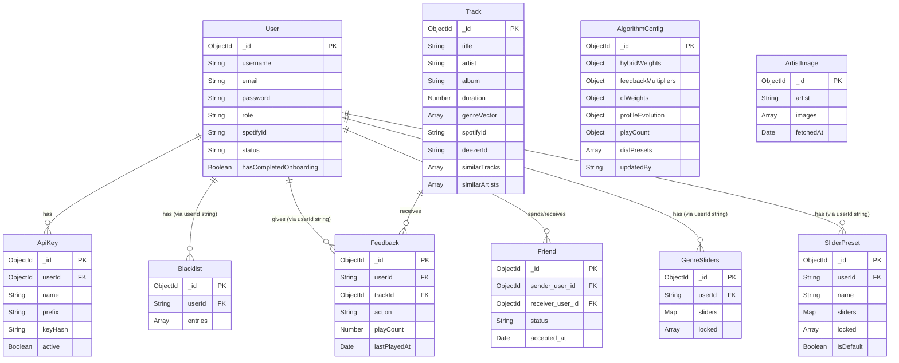

# SonarPoppy (Back-end)

Webservice for Poppy and SonarPop

:globe_with_meridians: Check out the live version: http://145.24.237.95:8000/

<details>
    <summary>Table of Contents</summary>
    <ol>
        <li><a href="#information_source-about-this-project">About this project</a></li>
        <li><a href="#sparkles-functionality">Functionality</a></li>
        <li>
            <a href="#rocket-getting-started">Getting started</a>
            <ol>
                <li><a href="#requirements">Requirements</a></li>
                <li><a href="#installation">Installation</a></li>
            </ol>
        </li>
        <li>
            <a href="#hammer_and_wrench-how-does-it-work">How does it work?</a>
            <ol>
                <li><a href="#technologies">Technologies</a></li>
                <li><a href="#entity-relationship-diagram">Entity Relationship Diagram</a></li>
                <li><a href="#usage">Usage</a></li>
            </ol>
        </li>
        <li><a href="#scroll-license">License</a></li>
    </ol>
</details>

[](https://github.com/AirMile)
[](https://github.com/BoorZuur)
[](https://github.com/Shav0nne)
[](https://github.com/Tooya-Igarashi)


## :information_source: About this project

SonarPoppy is an ethical AI recommender system that provides users with personalized recommendations while adhering to ethical guidelines.

This project was created for the third Tailored Learning Environment (Year 2) at Rotterdam University of Applied
Sciences. The goal of the project was to create an ethical AI recommender system while working in two seperate teams: a
front-end team and a back-end team.

> [!IMPORTANT]  
> This repository only contains the back-end of this project!
> The front-end repositories can be found [here (Poppy)](https://github.com/semvde/Poppy-Front_end) and [here (SonarPop)](https://github.com/Quinten-1074726/TLE3-Frontend-SonarPop).

> [!NOTE]  
> Read the documentation in the `docs/` folder for more information about this project.
> Read the api documentation in `docs/api-v1.md` for more information about the API endpoints and their usage.


## :sparkles: Functionality

The back-end of SonarPoppy provides the following functionality:
- User authentication and management
- API key management for third-party access
- Feedback collection and processing for improving recommendations
- Integration with external APIs (Spotify, Last.fm) for music data
- Administrative interface for managing algorithm configurations and monitoring system performance
- Image management for artists and user profiles
- Social features such as friend management and sharing recommendations
- Comprehensive logging and error handling for maintainability and debugging
- Automated testing to ensure reliability and facilitate future development

## :rocket: Getting started

Below are the instructions on how to get the project running on your local machine!

### Requirements

- Node.js & NPM
- MongoDB
- (Recommended) A REST client like Postman

### Installation

1. Clone the repository

```sh
git clone https://github.com/Shav0nne/sonarpoppy.git sonarpoppy
cd sonarpoppy
```

2. Setup dependencies and front-end assets

```sh
npm install
```
- Copy and paste the following contents into a .env file (inside the express folder):
```dotenv
MONGODB_URI=mongodb://localhost:27017/sonarpoppy
EXPRESS_PORT=8000
BASE_URI=http://localhost:8000/api/v1
LASTFM_API_KEY=your_lastfm_api_key_here
SPOTIFY_CLIENT_ID=your_spotify_client_id_here
SPOTIFY_CLIENT_SECRET=your_spotify_client_secret_here
JWT_SECRET=your_jwt_secret_here
```

3. Setup local test server

```sh
npm run dev
```

- View the website by going to http://localhost:8000

## :hammer_and_wrench: How does it work?

Below you can find the documentation of SonarPoppy (Back-end)!

### Technologies

SonarPoppy (Back-end) uses the following technologies:

- [![JavaScript][JavaScript.com]][JavaScript-url]
- [![Express][Express.com]][Express-url]
- [![MongoDB][MongoDB.com]][MongoDB-url]

### Entity Relationship Diagram



### Usage

After installation, you can run the project using the following command:

```bash
npm run dev
```

This will start the server in watch mode. The server will restart automatically when you make changes to the code.

By default, the server runs on port `8000` (or whatever is defined in your `.env` file).

#### API Access

The API is accessible at `/api/v1`.

- **Base URL**: `http://localhost:8000/api/v1`
- **Documentation**: detailed API documentation can be found in `docs/api-v1.md`. You can also import `docs/SonarPoppy.postman_collection.json` into Postman for testing.

#### Demo & Testing Interfaces

The project includes several simple HTML pages in the `public/` directory to facilitate testing and demonstration:

- **General Demo**: `http://localhost:8000/demo.html`
- **API Key Management**: `http://localhost:8000/api-keys.html`
- **Image Upload Test**: `http://localhost:8000/test-image-upload.html`
- **User Images**: `http://localhost:8000/test-user-images.html`
- **Playback Test**: `http://localhost:8000/playback.html`
- **Spotify Player**: `http://localhost:8000/spotify-player.html`

#### Running Tests

To run the automated test suite:

```bash
npm test
```

This uses the native Node.js test runner with experimental mocks enabled.

## :scroll: License

The source code in this repository is licensed under the MIT License.


[JavaScript.com]: https://img.shields.io/badge/JavaScript-F7DF1E?style=for-the-badge&logo=javascript&logoColor=black
[JavaScript-url]: https://developer.mozilla.org/en-US/docs/Web/JavaScript
[Express.com]: https://img.shields.io/badge/Express-000000?style=for-the-badge&logo=express&logoColor=white
[Express-url]: https://expressjs.com
[MongoDB.com]: https://img.shields.io/badge/MongoDB-47A248?style=for-the-badge&logo=mongodb&logoColor=white
[MongoDB-url]: https://www.mongodb.com